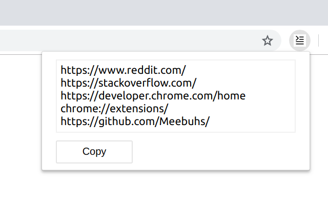

# Tablist
A simple extension which creates a list of the tabs open in the current window. 
Useful for storing links to resources or creating input for a scraper. 

## Download
[Available on the chrome web store](https://chrome.google.com/webstore/detail/ijdfnmbclpjjonoehpboopalfepbocjj)

