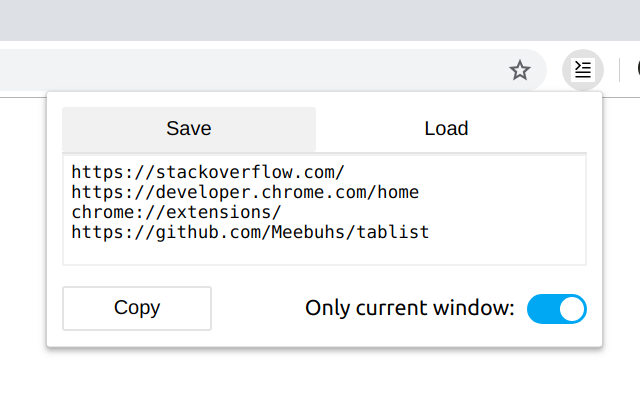

# Tablist
A simple extension which creates a list of the tabs open in either the current window or all open windows. 
Useful for storing links to resources or creating input for a scraper. 



## Getting Started

### Download 

[Available on the chrome web store](https://chrome.google.com/webstore/detail/ijdfnmbclpjjonoehpboopalfepbocjj)

### Build
You can build this extension locally using yarn

```
git clone https://github.com/Meebuhs/tablist
cd tablist
yarn
yarn build
```

Then, in chrome, go to 
```
chrome://extensions
```

Ensure developer mode is enabled and load an unpacked extension, pointing to build